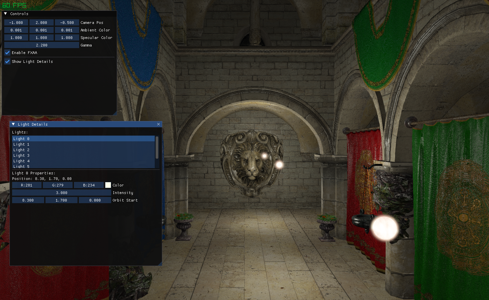

# Raylib Rendering Test Project

A test project for learning 3D rendering techniques using Raylib, featuring advanced lighting, HDR post-processing, and ImGui integration.

## Screenshot



## Features

- **3D Scene Rendering**: Renders the Sponza model with multiple point lights
- **HDR Rendering**: High Dynamic Range rendering pipeline with bloom effect
- **Post-Processing Effects**:
  - Gaussian blur bloom
  - HDR tone mapping with gamma correction
  - FXAA anti-aliasing
- **Dynamic Lighting**: Multiple orbiting light sources with configurable properties
- **Skybox**: Cubemap-based environment rendering
- **Interactive UI**: ImGui-based controls for:
  - Camera positioning
  - Lighting parameters
  - Individual light configuration
  - Post-processing settings

## Technical Implementation

### Shaders
- **Phong Lighting**: Advanced lighting model with normal mapping support
- **Emissive**: For glowing light orbs
- **Skybox**: Environment cubemap rendering
- **HDR**: Tone mapping and exposure control
- **Blur**: Gaussian blur for bloom effect
- **FXAA**: Fast approximate anti-aliasing

### Rendering Pipeline
1. **HDR Pass**: Renders scene to floating-point buffers
2. **Bright Pass**: Extracts bright areas for bloom
3. **Blur Pass**: Multi-pass Gaussian blur for bloom effect
4. **Tone Mapping**: HDR to LDR conversion with exposure/gamma
5. **FXAA**: Final anti-aliasing pass

## Controls

- **Right Mouse Button**: Free camera movement
- **UI Panel**: Adjust lighting, camera, and post-processing parameters
- **Light Details**: Configure individual light properties and positions

## Dependencies

- [Raylib](https://www.raylib.com/): Graphics and windowing
- [Dear ImGui](https://github.com/ocornut/imgui): User interface
- [rlImGui](https://github.com/raylib-extras/rlImGui): ImGui integration for Raylib

## Build Instructions

This project uses CMake for building. The dependencies (Raylib, ImGui, rlImGui) are automatically fetched during the CMake configuration.

1. Create a build directory:
   ```bash
   mkdir build
   cd build
   ```

2. Configure with CMake:
   ```bash
   cmake ..
   ```

3. Build the project:
   ```bash
   cmake --build .
   ```

4. Run the executable:
   ```bash
   ./raylib_test
   ```

## Project Structure

```
├── main.cpp              # Main application code
├── CMakeLists.txt         # Build configuration
├── resources/             # Shader and asset files
│   ├── shaders/          # GLSL shader files
│   ├── textures/         # Texture assets
│   └── objects/          # 3D model files
├── build/                # Build output directory
└── img/                  # Screenshots
```

## Learning Objectives

This project demonstrates:

- Modern OpenGL rendering techniques
- HDR and bloom post-processing
- Multi-light forward rendering
- Shader programming (vertex and fragment shaders)
- 3D graphics pipeline understanding
- Real-time rendering optimization
- Integration of third-party libraries

## License

This is a personal learning project. Assets and dependencies retain their respective licenses.
